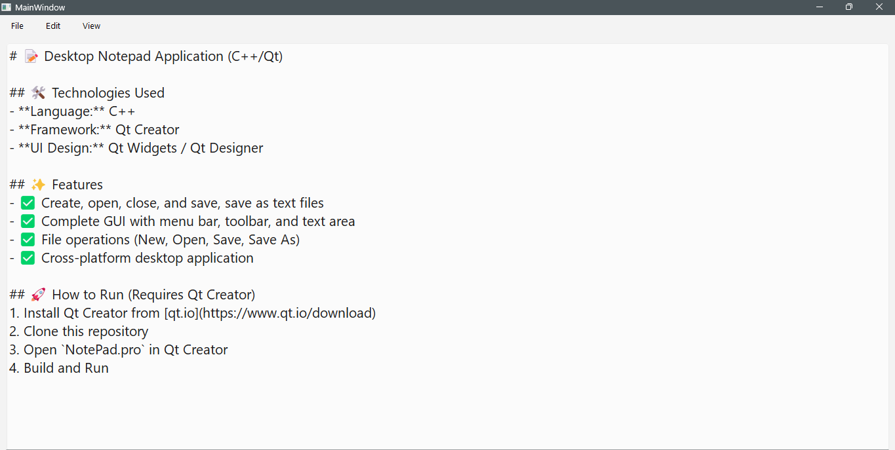
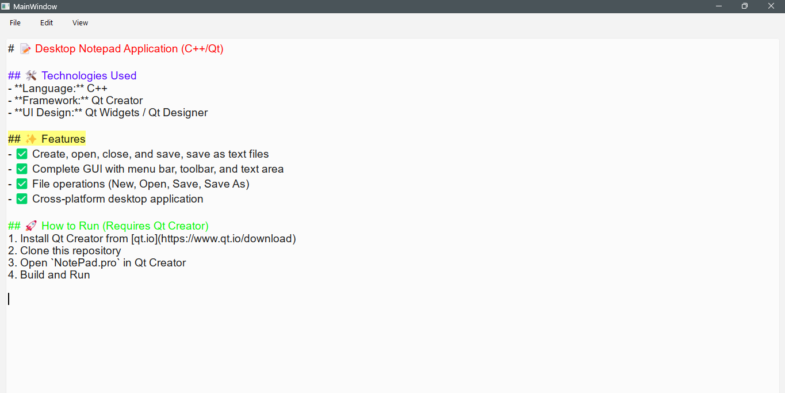
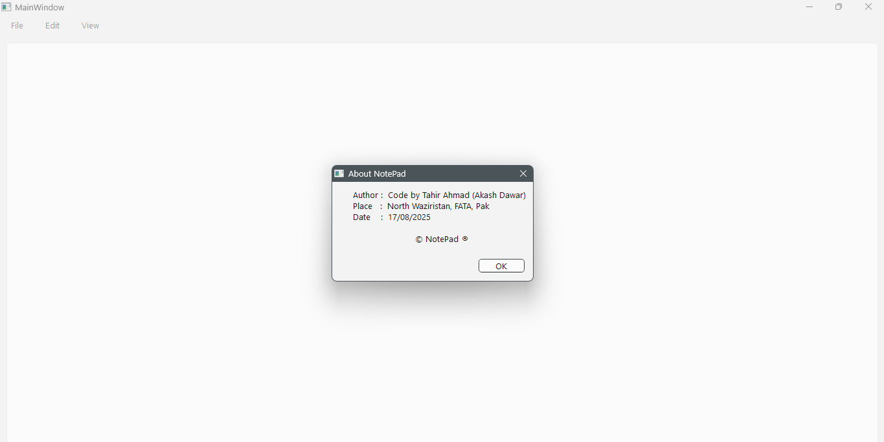
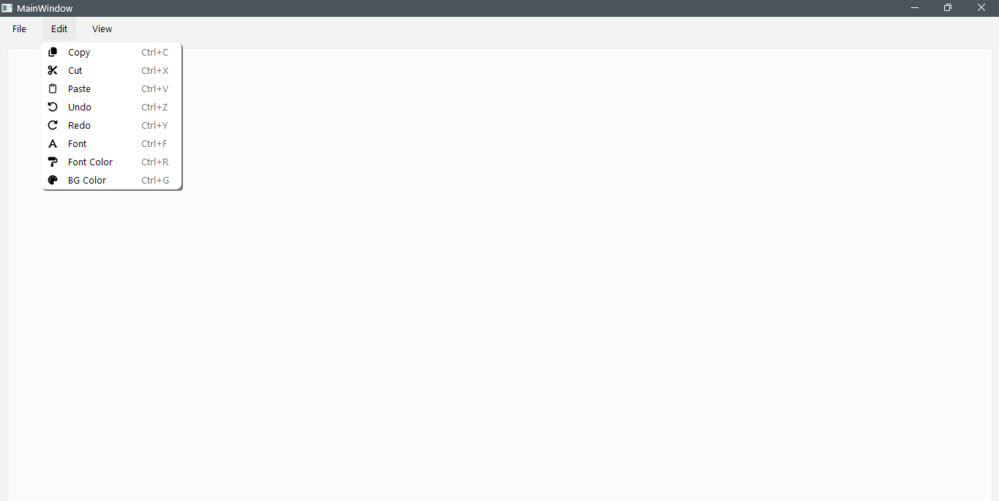
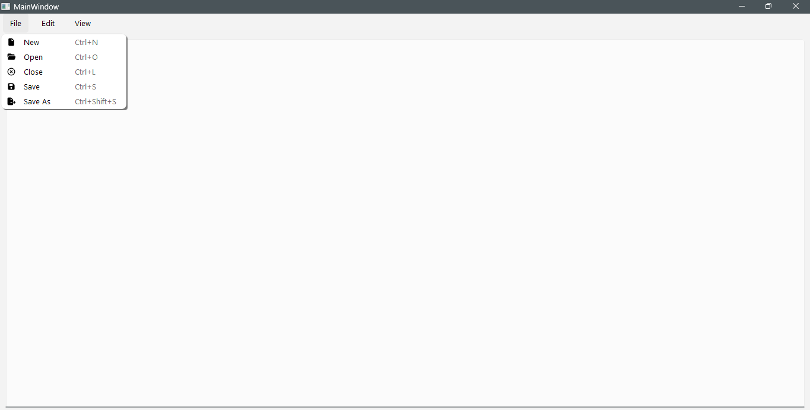

# 📝 Desktop Notepad Application

Developed a full-featured desktop Notepad application using C++ and the Qt Creator framework. Implemented core functionalities including text editing, file saving/loading, and a complete graphical user interface. This project strengthened my understanding of UI/UX design principles, event handling, and cross-platform desktop development.


## 🖼️ Screenshots

<div align="center">
  
  
  <br><br>
  
  
  <br><br>
  
</div>

## 🎯 About The Project

Developed a full-featured desktop Notepad application using **C++** and the **Qt Creator framework**.

### ✨ Features
- ✅ Create, open, edit, and save, save as text files
- ✅ Complete graphical user interface
- ✅ File operations (New, Open, Save, Save As)
- ✅ Cross-platform desktop application
- ✅ Professional UI/UX design

### 🛠️ Built With
- **Language:** C++17
- **Framework:** Qt 6 / Qt Creator
- **UI Design:** Qt Widgets / Qt Designer

## 🚀 Getting Started

### Prerequisites
- Qt Creator (Download from [qt.io](https://www.qt.io/download))

### Installation
1. Clone the repository
```bash
git clone https://github.com/TahirAhmad88/DesktopNotepadApplicationCPlusPlusAndQt.git
